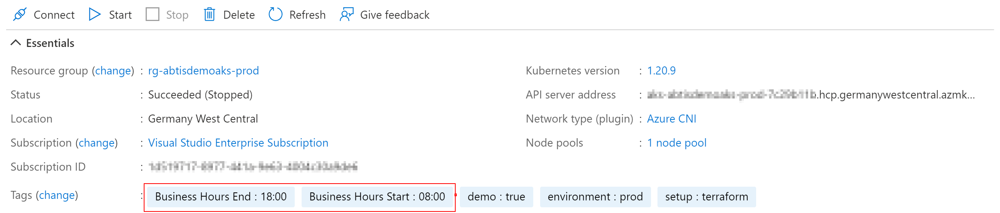

# AKS Start/Stop Logic Apps

The AKS Start/Stop logic apps help you to automatically start and stop your Azure Kubernetes Service clusters, so they are only available within a specific time range. The project targets administrators and developers who just want to run their clusters within their business hours and also safe some money.

The solution uses Azure Logic Apps (Consumption) for an easy integration in your system. You can change parameters and update your deployment as you want.  
Because of technical restrictions the logic apps and their dependencies must be deployed for each subscription you want to watch. The used logic app actions are restricted to one specific subscription.

After the deployment of the Azure Resources you can tag your AKS Cluster with `Business Hours Start` and `Business Hours End` tags to ensure the cluster is only available during the specified time. The tag value is a time value in *24h format*, e.g. `08:00` or `18:00`.



## Deployment

### 1. Create service principal

To retrieve AKS information and to execute AKS actions (start and stop), it's a good approach to use a dedicated service principal that does the job.

- Create a service principal with sufficient permissions on subscription level
    ```
    az ad sp create-for-rbac -n aks-automation --role 'Azure Kubernetes Service Contributor Role'
    ```
- Save the `appId` and `password` information for the resource deployment step

> The role *Azure Kubernetes Service Contributor Role* has high permissions, but is built-in and available in every environment. It should not be used in production ready environments. A best practice is to create a custom role which only has the required permissions. A sample custom role definition in bicep format can be found here: [deployment/aks-automation-executor-role-definition.bicep](deployment/aks-automation-executor-role-definition.bicep)

### 2. Resource deployment

Deploy the resources to your environment and follow the instructions.

[](https://portal.azure.com/#create/Microsoft.Template/uri/https%3A%2F%2Fraw.githubusercontent.com%2Fdaniellindemann%2Faks-start-stop-logicapp%2Fmain%2Fdeployment%2Fazuredeploy.json)

After the deployment you'll find 2 logic apps and 1 api connection.


## Configuration

After the Azure resources are deployed, add tags to your AKS resources.

| Tag | Required | Description | Example Value |
|-----|----------|-------------|---------------|
| Business Hours Start | Required | Time of AKS startup in 24h format | 08:00 | 
| Business Hours End | Required | Time of AKS shutdown in 24h format | 18:00 |
| Business Hours Days | Optional | Days the AKS should start and stop (Default: Mon,Tue,Wed,Thu,Fri) | Mon,Tue,Wed,Thu,Fri,Sat |

## Customization

During the resource deployment you can change the Azure tags you want to use on your AKS resources. If you want change the tag names, you can configure your own tags during the deployment of the Azure resources.


## License

[MIT License](LICENSE)
